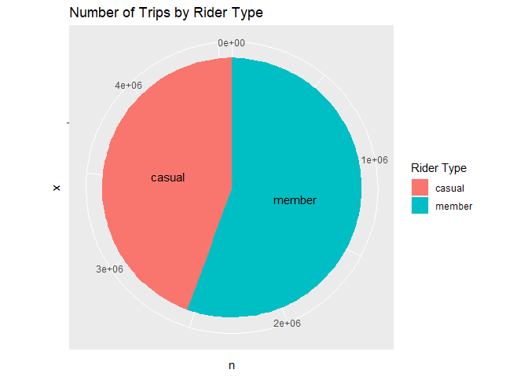
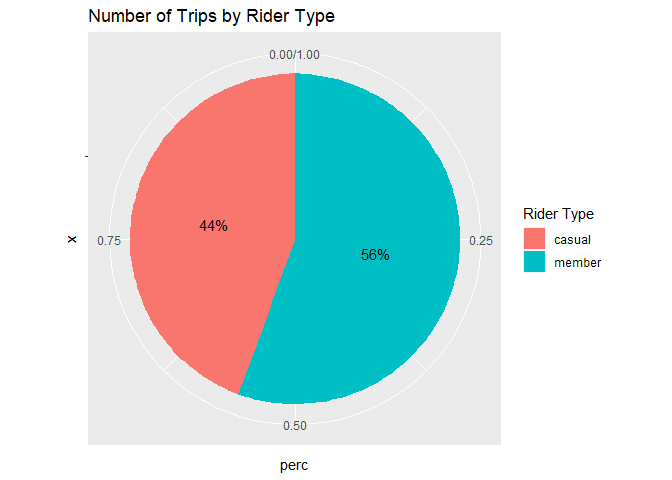
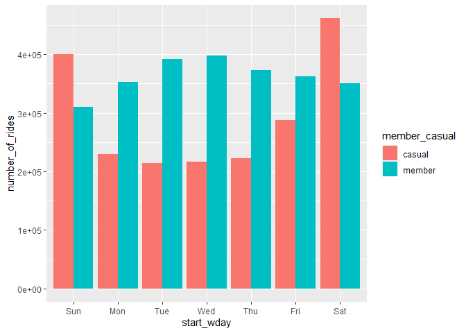
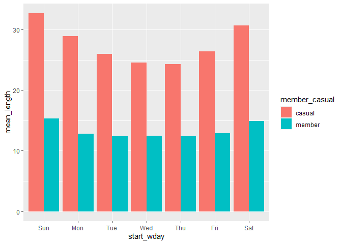

Google Data Analytics Certificate - Bike Share Case Study
================
K.Wan
2022/3/28

## Case Background

This analysis is for case study 1 from the Google Data Analytics
Certificate (Cyclistic). It’s originally based on the case study
*[Sophisticated, Clear, and Polished: Divvy and Data
Visualization](https://artscience.blog/home/divvy-dataviz-case-study)*
by Kevin Hartman.

I will be using the [Divvy
dataset](https://divvy-tripdata.s3.amazonaws.com/index.html) for this
capstone project. The purpose of this script is to consolidate
downloaded Divvy data into a single dataframe and then conduct simple
analysis to help answer the key question:“**In what ways do members and
casual riders use Divvy bikes differently?**”

In the Google Data Analytics Certificate programme, there are mainly six
phases: **Ask**, **Prepare**, **Process**, **Analyse**, **Share**, and
**Act**. Since this capstone challenge has outlined my tasks as a junior
data analyst in this fictitious bike sharing company and provided real
first-party data, my job will jump right into the **Process** of data.

## Process

### Get data ready

For convenience, I will first load three useful packages: `tidyverse`
for data import and wrangling, `lubridate` for date functions, and
`ggplot2` for visualisation.

``` r
# install.packages("tidyverse")
# install.packages("lubridate")

library(tidyverse) # data import and tidy
```

    ## -- Attaching packages --------------------------------------- tidyverse 1.3.1 --

    ## v ggplot2 3.3.5     v purrr   0.3.4
    ## v tibble  3.1.6     v dplyr   1.0.8
    ## v tidyr   1.2.0     v stringr 1.4.0
    ## v readr   2.1.2     v forcats 0.5.1

    ## -- Conflicts ------------------------------------------ tidyverse_conflicts() --
    ## x dplyr::filter() masks stats::filter()
    ## x dplyr::lag()    masks stats::lag()

``` r
library(lubridate) # functions set for date, time
```

    ## 
    ## Attaching package: 'lubridate'

    ## The following objects are masked from 'package:base':
    ## 
    ##     date, intersect, setdiff, union

``` r
library(ggplot2) # helps visualise data
```

**1. Upload datasets**

In this analysis, I will investigate data in the past twelve months,
spanning from December 2021 to February 2022.

Function `readr::read_csv` is preferred to `read.csv` of package `base`
for a number of reasons:
<https://r4ds.had.co.nz/data-import.html#compared-to-base-r>.

``` r
dt_2202 <- read_csv("202202-divvy-tripdata.csv", na = "")
# na = "" is to assign blank cell with NA
dt_2201 <- read_csv("202201-divvy-tripdata.csv", na = "")
dt_2103 <- read_csv("202103-divvy-tripdata.csv", na = "")
dt_2104 <- read_csv("202104-divvy-tripdata.csv", na = "")
dt_2105 <- read_csv("202105-divvy-tripdata.csv", na = "")
dt_2106 <- read_csv("202106-divvy-tripdata.csv", na = "")
dt_2107 <- read_csv("202107-divvy-tripdata.csv", na = "")
dt_2108 <- read_csv("202108-divvy-tripdata.csv", na = "")
dt_2109 <- read_csv("202109-divvy-tripdata.csv", na = "")
dt_2110 <- read_csv("202110-divvy-tripdata.csv", na = "")
dt_2111 <- read_csv("202111-divvy-tripdata.csv", na = "")
dt_2112 <- read_csv("202112-divvy-tripdata.csv", na = "")
```

**2. Merging multiple tables**

Before combining tables into a single data frame, I need to observe
components of each table, specifically column names of each file, in
order to make merge compatible.

Following code chunk displays some useful techniques when dealing with
this issue.

``` r
# check column names, for they need to match perfectly before we can combine files by rows
colnames(dt_2103)
colnames(dt_2104)
# if there are mismatched column names, we can rename columns to make them consisten, e.g.:
dt_2103 <- rename(dt_2103, new_name = old_name)
# inspect the dataframes and look for inconguencies
str(dt_2103)
# change column types if needed, e.g. convert ride_id to character so that they can stack correctly
dt_2103 <- mutate(dt_2103, ride_id = as.character(ride_id))
```

``` r
dt_all <- rbind(dt_2103, dt_2104, dt_2105, dt_2106,
                dt_2107, dt_2108, dt_2109, dt_2110,
                dt_2111, dt_2112, dt_2201, dt_2202)
# dplyr::bind_rows() is a good alternative 
glimpse(dt_all)  # view the structure of the dataframe
```

    ## Rows: 5,667,986
    ## Columns: 13
    ## $ ride_id            <chr> "CFA86D4455AA1030", "30D9DC61227D1AF3", "846D87A156~
    ## $ rideable_type      <chr> "classic_bike", "classic_bike", "classic_bike", "cl~
    ## $ started_at         <dttm> 2021-03-16 08:32:30, 2021-03-28 01:26:28, 2021-03-~
    ## $ ended_at           <dttm> 2021-03-16 08:36:34, 2021-03-28 01:36:55, 2021-03-~
    ## $ start_station_name <chr> "Humboldt Blvd & Armitage Ave", "Humboldt Blvd & Ar~
    ## $ start_station_id   <chr> "15651", "15651", "15443", "TA1308000021", "525", "~
    ## $ end_station_name   <chr> "Stave St & Armitage Ave", "Central Park Ave & Bloo~
    ## $ end_station_id     <chr> "13266", "18017", "TA1308000043", "13323", "E008", ~
    ## $ start_lat          <dbl> 41.91751, 41.91751, 41.84273, 41.96881, 42.01270, 4~
    ## $ start_lng          <dbl> -87.70181, -87.70181, -87.63549, -87.65766, -87.666~
    ## $ end_lat            <dbl> 41.91774, 41.91417, 41.83066, 41.95283, 42.05049, 4~
    ## $ end_lng            <dbl> -87.69139, -87.71676, -87.64717, -87.64999, -87.677~
    ## $ member_casual      <chr> "casual", "casual", "casual", "casual", "casual", "~

``` r
old_records <- nrow(dt_all)
```

The resulting tibble consists of 5,667,986 rows with 13 columns of
character and numeric data such as ride id, start and end time of ride,
start location, geographic coordinates, etc.

### Data cleaning

Data tidying usually involves checking for missing values, trailing
white spaces, duplicate records, and other data anomalies.

**1. Duplicates**

To check duplicates, `distinct()` is used to check duplicates based on
all of columns while it is also an option to screen on `ride_id` alone.
The result shows no duplicates removed.

``` r
dt_all <- dt_all %>% 
  distinct()
# distinct(ride_id, .keep_all = TRUE), based on ride_id alone
## no duplicates removed
nrow_old <- nrow(dt_all)
```

**2. Missing values**

``` r
apply(dt_all, 2, function (x) {mean(is.na(x))})
```

    ##            ride_id      rideable_type         started_at           ended_at 
    ##       0.0000000000       0.0000000000       0.0000000000       0.0000000000 
    ## start_station_name   start_station_id   end_station_name     end_station_id 
    ##       0.1257903601       0.1257898308       0.1344070010       0.1344070010 
    ##          start_lat          start_lng            end_lat            end_lng 
    ##       0.0000000000       0.0000000000       0.0008145751       0.0008145751 
    ##      member_casual 
    ##       0.0000000000

Since there is no missing value on identifier column `ride_id` and the
proportion of missing data on each variable is no more than 14%, it is
practically acceptable to drop rows containing `NA`.

``` r
dt_all <- dt_all %>% drop_na(start_station_name, start_station_id, end_station_name, end_station_id,
                       end_lat, end_lng)
nrow_new <- nrow(dt_all)
```

Then 1,036,883 rows have been deleted, accounting for merely 18% of
original data size.

**3. Strings**

When it comes to characters, typos or miscellaneous errors are not
uncommon. Error-prone strings can be due to careless data entry or even
on purpose, they are not easy to spot and even more time-consuming or
painstaking to fix.

Note that there are a few station ids representing more than one station
name due to either typo or unknown minor changes. The following steps
show how to identify mistyped station names and then conduct error
checking.

However, manually fixing the problem of station names is not essential
to answering questions of our interest and using station id alone is
sufficient.

``` r
dup_id <- dt_all %>% 
  count(start_station_id, start_station_name) %>% 
  filter(duplicated(start_station_id)) %>% 
  select(start_station_id) # return ids appearing more than once

dup_id <- unlist(as.list(dup_id)) # transform tibble into list first then to vector as `as.vector()` not applicable 

dt_all %>% 
  count(start_station_id, start_station_name) %>% 
  filter(start_station_id %in% dup_id)
```

**4. Dates**

Addressing `date` columns is necessary for analysing the dynamics of
rides on different time frames. With each ride record contains the exact
time points for start and end, this analysis can come up with a more
meaningful metric - ride length - a calculated field using the
difference between columns `ended_at` and `started_at`.

``` r
dt_all <- dt_all %>% 
  mutate(started_at = ymd_hms(started_at),
         ended_at = ymd_hms(ended_at),
         ride_length = ended_at - started_at) # figures in seconds, difftime is an alternative function
```

Convert the unit of ride length from `seconds` to `minutes`.

``` r
dt_all <- dt_all %>% 
  mutate(ride_length_m = round((as.numeric(ride_length)/60), digits = 2))
```

Dissect `date` by year, month, day and weekday.

The reason is that data can only be aggregated at the ride-level, which
is too granular based on original date formats. So I will add some
additional columns of data – such as day, month, year, weekday – that
provide additional opportunities to aggregate the data.

``` r
dt_all <- dt_all %>% 
  mutate(start_year = year(started_at), 
         end_year = year(ended_at), 
         start_month = month(started_at), # month as number
         end_month = month(ended_at),
         start_Month = month(started_at, label = TRUE), # months as Jan, Feb 
         end_Month = month(ended_at, label = TRUE), 
         start_day = mday(started_at), # day of month
         end_day = mday(ended_at), 
         start_wday = wday(started_at, label = TRUE), # day of week
         end_wday = wday(ended_at, label = TRUE))
```

**5. Remove “bad” data**

Despite no clear definition of “bad” data, here I need to spot data that
takes only a small number while having values that can
disproportionately influence our findings ,and then sometimes delete
them.

In this case, I will remove extremely large and negative values in
`ride_length` since they make no practical sense for the majority of
users and can distort data distribution, but how to address outliers is
a case-by-case study.

Specifically, records for trips less than 60 seconds (false starts) or
longer than 24 hours were removed. Bikes out longer than 24 hours are
considered stolen and the rider is charged for a replacement. Idea
inspired from:
<https://vibrantoutlook.wordpress.com/2021/09/19/google-data-analytics-certificate-capstone-project/>

``` r
dt_all02 <- dt_all %>% 
  filter(end_day - start_day < 2 & 
           between(ride_length_m, 1, 1440))
# filter rides spanning across within 2 days 
# while not lasting above 24 hours/ 1440 minutes, 
# above 1 for filtering out negative results and false starts
```

61,649 records removed.

Meanwhile, rides that started or ended at DIVVY CASSETTE *REPAIR* MOBILE
STATION or HUBBARD ST BIKE *CHECKING* (LBS-WH-TEST) or WATSON *TESTING*
DIVVY could be ignored as these are administrative stations. were
removed as these are administrative stations. (Link for reference:
<https://vibrantoutlook.wordpress.com/2021/09/19/google-data-analytics-certificate-capstone-project/>)

For brevity, I use `str_detect()` to find matches containing any
characters of `REPAIR`, `TESTING` or `CHECKING`.

``` r
# find matches
dt_all02 %>% 
  filter(str_detect(start_station_name, "REPAIR|TESTING|CHECKING") | str_detect(end_station_name, "REPAIR|TESTING|CHECKING")) %>% 
  select(ride_id, start_station_id, end_station_id)
```

    ## # A tibble: 8 x 3
    ##   ride_id          start_station_id                     end_station_id          
    ##   <chr>            <chr>                                <chr>                   
    ## 1 04B18873381AACA9 DIVVY CASSETTE REPAIR MOBILE STATION 13029                   
    ## 2 A4354906AD557A6C DIVVY CASSETTE REPAIR MOBILE STATION 13300                   
    ## 3 7FC9FCDB10ED2658 13042                                DIVVY CASSETTE REPAIR M~
    ## 4 DC4828A1C0B5E51F 13042                                DIVVY CASSETTE REPAIR M~
    ## 5 81EAE44D67406AFE 13042                                DIVVY CASSETTE REPAIR M~
    ## 6 886DF564595B8928 13042                                DIVVY CASSETTE REPAIR M~
    ## 7 74B6C966F82A9FD5 DIVVY CASSETTE REPAIR MOBILE STATION 13300                   
    ## 8 C0D3A64896642496 DIVVY CASSETTE REPAIR MOBILE STATION 13300

8 records detected to be removed.

``` r
# remove matches
dt_all02 <- dt_all02 %>% 
  filter(!str_detect(start_station_name, "REPAIR|TESTING|CHECKING") & !str_detect(end_station_name, "REPAIR|TESTING|CHECKING")) # !(A | B) == !A & !B
```

At the end of data cleaning, 1,098,540 rows have been deleted,
accounting for 19% of original data size.

## Analyse

Here comes the first question: How many observations fall under each
user type?

``` r
(dt_all_freq <- dt_all02 %>% 
  count(member_casual))
```

    ## # A tibble: 2 x 2
    ##   member_casual       n
    ##   <chr>           <int>
    ## 1 casual        2031039
    ## 2 member        2538407

As shown above, more than 507368 rides were by members than casual
riders in the whole time period.

Then, I conduct descriptive analysis on **ride length**, answering
questions like:

> Is there a difference on total/average ride lengths among the two user
> groups?  
> How is that difference varied on monthly/daily level?

**1. Total ride lengths**

Let’s have a look at the total, average, median, minimum and maximum.

``` r
dt_all02 %>% 
  group_by(member_casual) %>% 
  summarise(number_of_rides = n(),
            total_length = sum(ride_length_m), 
            mean_length = mean(ride_length_m),
            median_length = median(ride_length_m), 
            max_length = max(ride_length_m), 
            min_length = min(ride_length_m))
```

    ## # A tibble: 2 x 7
    ##   member_casual number_of_rides total_length mean_length median_length
    ##   <chr>                   <int>        <dbl>       <dbl>         <dbl>
    ## 1 casual                2031039    57695524.        28.4         16.8 
    ## 2 member                2538407    33592312.        13.2          9.75
    ## # ... with 2 more variables: max_length <dbl>, min_length <dbl>

Overall, more rides were taken by members while casual riders enjoyed
longer trips, contributing nearly double the total ride length of
members’ during the same time period.

The average duration of each ride by casual riders is around 28.4
minutes, two times more of the 13.2 minutes for annual members.

**2. Ride length by month**

``` r
dt_all02 %>% 
  group_by(member_casual, start_Month) %>% 
  summarise(sum_length_m = sum(ride_length_m), 
            mean_length_m = mean(ride_length_m)) %>%
  arrange(member_casual, start_Month) %>% 
  head(12)
```

    ## `summarise()` has grouped output by 'member_casual'. You can override using the
    ## `.groups` argument.

    ## # A tibble: 12 x 4
    ## # Groups:   member_casual [1]
    ##    member_casual start_Month sum_length_m mean_length_m
    ##    <chr>         <ord>              <dbl>         <dbl>
    ##  1 casual        Jan              227496.          18.3
    ##  2 casual        Feb              322847.          21.6
    ##  3 casual        Mar             2433254.          32.5
    ##  4 casual        Apr             3860655.          32.4
    ##  5 casual        May             7173380.          33.5
    ##  6 casual        Jun             9341985.          31.1
    ##  7 casual        Jul            10502955.          28.8
    ##  8 casual        Aug             9246271.          27.4
    ##  9 casual        Sep             7668660.          26.4
    ## 10 casual        Oct             4600798.          24.6
    ## 11 casual        Nov             1410656.          20.4
    ## 12 casual        Dec              906566.          20.3

It seems like the second quarter (April, May & June) to be a period that
has experienced relatively longer duration of rides by casual riders.

**3. Which day of a week induced most traffic**

See the number of trips and average ride duration on each day of a week
for all users.

``` r
dt_all02 %>% 
  group_by(start_wday) %>% 
  summarise(number_of_rides = n(), 
            total_length = sum(ride_length_m), 
            mean_length = mean(ride_length_m))
```

    ## # A tibble: 7 x 4
    ##   start_wday number_of_rides total_length mean_length
    ##   <ord>                <int>        <dbl>       <dbl>
    ## 1 Sun                 710796    17826587.        25.1
    ## 2 Mon                 582014    11138952.        19.1
    ## 3 Tue                 605821    10420861.        17.2
    ## 4 Wed                 614700    10286544.        16.7
    ## 5 Thu                 594966    10018268.        16.8
    ## 6 Fri                 648908    12232708.        18.9
    ## 7 Sat                 812241    19363918.        23.8

Compare ridership, average ride length by weekday for members vs casual
riders.

``` r
dt_all02 %>% 
  group_by(member_casual, start_wday) %>% 
  summarise(number_of_rides = n(), 
            total_length = sum(ride_length_m), 
            mean_length = mean(ride_length_m)) %>% 
  arrange(member_casual, start_wday) 
```

    ## `summarise()` has grouped output by 'member_casual'. You can override using the
    ## `.groups` argument.

    ## # A tibble: 14 x 5
    ## # Groups:   member_casual [2]
    ##    member_casual start_wday number_of_rides total_length mean_length
    ##    <chr>         <ord>                <int>        <dbl>       <dbl>
    ##  1 casual        Sun                 400541    13082608.        32.7
    ##  2 casual        Mon                 229094     6631544.        28.9
    ##  3 casual        Tue                 213847     5556801.        26.0
    ##  4 casual        Wed                 216633     5317038.        24.5
    ##  5 casual        Thu                 222197     5395626.        24.3
    ##  6 casual        Fri                 287122     7568258.        26.4
    ##  7 casual        Sat                 461605    14143649.        30.6
    ##  8 member        Sun                 310255     4743979.        15.3
    ##  9 member        Mon                 352920     4507408.        12.8
    ## 10 member        Tue                 391974     4864059.        12.4
    ## 11 member        Wed                 398067     4969505.        12.5
    ## 12 member        Thu                 372769     4622642.        12.4
    ## 13 member        Fri                 361786     4664450.        12.9
    ## 14 member        Sat                 350636     5220269.        14.9

Regardless of the user type, weekends undoubtedly enjoyed peak usage,
which can possibly guide us in deciding marketing times.

**4. Top 10 busiest stations**

To better market membership of Divvy, hence attracting more casual
riders to subscribe as members, stations mostly visited by casual users
may be a great choice as locations for the upcoming campaign.

``` r
dt_all02 %>% 
  filter(member_casual == "casual") %>% 
  group_by(start_station_id) %>% 
  summarise(n = n()) %>% 
  arrange(desc(n)) %>% 
  select(start_station_id, n) %>% 
  head(10)
```

    ## # A tibble: 10 x 2
    ##    start_station_id     n
    ##    <chr>            <int>
    ##  1 13022            63837
    ##  2 13300            34325
    ##  3 13008            31788
    ##  4 13042            28327
    ##  5 LF-005           28322
    ##  6 15544            22353
    ##  7 TA1308000001     20329
    ##  8 TA1308000050     18741
    ##  9 13179            16093
    ## 10 KA1504000135     15708

Is there any difference on station preference between casual riders and
annual members?

``` r
dt_all02 %>% 
  filter(member_casual == "member") %>% 
  group_by(start_station_id) %>% 
  summarise(n = n()) %>% 
  arrange(desc(n)) %>% 
  select(start_station_id, n) %>% 
  head(10)
```

    ## # A tibble: 10 x 2
    ##    start_station_id     n
    ##    <chr>            <int>
    ##  1 TA1307000039     23636
    ##  2 KA1503000043     23310
    ##  3 TA1308000050     22768
    ##  4 KA1504000135     20123
    ##  5 13045            18247
    ##  6 13016            18065
    ##  7 TA1306000012     18018
    ##  8 LF-005           17425
    ##  9 13137            16842
    ## 10 TA1305000032     16680

Overall, which stations can reach out to most users regardless of user
type.

``` r
dt_all02 %>% 
  group_by(start_station_id) %>% 
  summarise(n = n()) %>% 
  arrange(desc(n)) %>% 
  select(start_station_id, n) %>% 
  head(10)
```

    ## # A tibble: 10 x 2
    ##    start_station_id     n
    ##    <chr>            <int>
    ##  1 13022            79396
    ##  2 LF-005           45747
    ##  3 13300            44216
    ##  4 13042            42232
    ##  5 TA1308000050     41509
    ##  6 13008            40051
    ##  7 TA1307000039     39125
    ##  8 KA1504000135     35831
    ##  9 TA1308000001     35270
    ## 10 KA1503000043     32742

As shown above, there is undeniably a distinct difference on stations
choices made by members and casual riders.

Even though I think sticking to station id is easier, but for map viz,
names of locations are better for presentation. Since I will focus on
mainly the top 10 stations most visited by casual riders for past 12
months, only two ids in the top 10 list that also appears in the
duplicated list before: `13300` and `LF-005`. So I will fix the names of
stations belonging to those two ids.

It turns out, recently [Chicago’s iconic Lake Shore Drive has been
renamed in honor of Jean Baptiste Point
DuSable](https://blockclubchicago.org/2021/10/21/lake-shore-drive-signs-now-have-its-new-name-dusable-lake-shore-drive-honoring-citys-black-founder/),
so the `Lake Shore Dr` in the data set has been renamed
`DuSable Lake Shore Dr` shown in more recent records. And luckily, both
cases of duplicates are due to the same reason. Then I will just update
the station names accordingly.

``` r
dt_all02 %>% 
  count(start_station_id, start_station_name) %>% 
  filter(start_station_id %in% c("13300", "LF-005"))
```

    ## # A tibble: 4 x 3
    ##   start_station_id start_station_name                     n
    ##   <chr>            <chr>                              <int>
    ## 1 13300            DuSable Lake Shore Dr & Monroe St  20582
    ## 2 13300            Lake Shore Dr & Monroe St          23634
    ## 3 LF-005           DuSable Lake Shore Dr & North Blvd 23433
    ## 4 LF-005           Lake Shore Dr & North Blvd         22314

``` r
dt_all02 <- dt_all02 %>% 
  mutate(start_station_name = case_when(
    start_station_id == "13300" ~ "DuSable Lake Shore Dr & Monroe St",
    start_station_id == "LF-005" ~ "DuSable Lake Shore Dr & North Blvd",
    TRUE ~ start_station_name
  ))
```

Now, test with updated station names.

``` r
dt_all02 %>% 
  filter(member_casual == "casual") %>% 
  group_by(start_station_id) %>% 
  summarise(n = n()) %>% 
  arrange(desc(n)) %>% 
  select(start_station_id, n) %>% 
  head(10)
```

    ## # A tibble: 10 x 2
    ##    start_station_id     n
    ##    <chr>            <int>
    ##  1 13022            63837
    ##  2 13300            34325
    ##  3 13008            31788
    ##  4 13042            28327
    ##  5 LF-005           28322
    ##  6 15544            22353
    ##  7 TA1308000001     20329
    ##  8 TA1308000050     18741
    ##  9 13179            16093
    ## 10 KA1504000135     15708

``` r
dt_all02 %>% 
  filter(member_casual == "casual") %>% 
  group_by(start_station_name) %>% 
  summarise(n = n()) %>% 
  arrange(desc(n)) %>% 
  select(start_station_name, n) %>% 
  head(10)
```

    ## # A tibble: 10 x 2
    ##    start_station_name                     n
    ##    <chr>                              <int>
    ##  1 Streeter Dr & Grand Ave            63837
    ##  2 DuSable Lake Shore Dr & Monroe St  34325
    ##  3 Millennium Park                    31788
    ##  4 Michigan Ave & Oak St              28327
    ##  5 DuSable Lake Shore Dr & North Blvd 28322
    ##  6 Shedd Aquarium                     22353
    ##  7 Theater on the Lake                20329
    ##  8 Wells St & Concord Ln              18741
    ##  9 Clark St & Lincoln Ave             16093
    ## 10 Wells St & Elm St                  15708

**5. The proportion of casual riders and annual members for each
station**

I want to produce a table with each row representing a unique station
id, columns involving number of rides by members, by casual riders, and
their individual proportion of total number of rides.

``` r
(prop_dt <- dt_all02 %>% 
  group_by(start_station_id, member_casual) %>% 
  summarise(n = n()))
```

    ## `summarise()` has grouped output by 'start_station_id'. You can override using
    ## the `.groups` argument.

    ## # A tibble: 1,632 x 3
    ## # Groups:   start_station_id [835]
    ##    start_station_id member_casual     n
    ##    <chr>            <chr>         <int>
    ##  1 13001            casual        13488
    ##  2 13001            member        10852
    ##  3 13006            casual         3212
    ##  4 13006            member         6692
    ##  5 13008            casual        31788
    ##  6 13008            member         8263
    ##  7 13011            casual         5204
    ##  8 13011            member        11765
    ##  9 13016            casual        10233
    ## 10 13016            member        18065
    ## # ... with 1,622 more rows

This tibble having multiple values stacked in a small number of columns
needs the function `pivot_wider` to make it wider.

``` r
prop_dt %>% 
  pivot_wider(names_from = member_casual, values_from = n) %>% 
  mutate(total = casual + member, casual_freq = casual/total, member_freq = member/total) %>% 
  arrange(desc(casual))
```

    ## # A tibble: 835 x 6
    ## # Groups:   start_station_id [835]
    ##    start_station_id casual member total casual_freq member_freq
    ##    <chr>             <int>  <int> <int>       <dbl>       <dbl>
    ##  1 13022             63837  15559 79396       0.804       0.196
    ##  2 13300             34325   9891 44216       0.776       0.224
    ##  3 13008             31788   8263 40051       0.794       0.206
    ##  4 13042             28327  13905 42232       0.671       0.329
    ##  5 LF-005            28322  17425 45747       0.619       0.381
    ##  6 15544             22353   4747 27100       0.825       0.175
    ##  7 TA1308000001      20329  14941 35270       0.576       0.424
    ##  8 TA1308000050      18741  22768 41509       0.451       0.549
    ##  9 13179             16093  15496 31589       0.509       0.491
    ## 10 KA1504000135      15708  20123 35831       0.438       0.562
    ## # ... with 825 more rows

In result, the list of 10 stations boasting far more visits from casual
riders than members is the same as before.

## Share

It is time to visualise our findings to vividly demonstrate differences
on riding patterns between different rider types.

**1. Members ride more often than non-members**

Look at the pie chart below, showing the discrepancy on numbers of rides
by rider type.

``` r
library(scales)
```

    ## Warning: package 'scales' was built under R version 4.0.5

    ## 
    ## Attaching package: 'scales'

    ## The following object is masked from 'package:purrr':
    ## 
    ##     discard

    ## The following object is masked from 'package:readr':
    ## 
    ##     col_factor

``` r
dt_all02 %>% 
  group_by(member_casual) %>% 
  count() %>% 
  ungroup() %>% 
  ggplot(aes(x = "", y = n, fill = member_casual))+
  geom_col()+
  geom_text(aes(label = member_casual), position = position_stack(vjust = 0.5)) +
  labs(title = "Number of Trips by Rider Type")+
  guides(fill = guide_legend(title = "Rider Type"))+
  coord_polar("y")
```

<!-- -->

``` r
dt_all02 %>% 
  group_by(member_casual) %>% 
  count() %>% 
  ungroup() %>% 
  mutate(perc = n/sum(n)) %>% 
  mutate(labels = scales::percent(perc)) %>% 
  ggplot(aes(x = "", y = perc, fill = member_casual))+
  geom_col()+
  geom_text(aes(label = labels), position = position_stack(vjust = 0.5)) +
  labs(title = "Number of Trips by Rider Type")+
  guides(fill = guide_legend(title = "Rider Type"))+
  coord_polar("y")
```

<!-- -->

    ## `summarise()` has grouped output by 'member_casual'. You can override using the
    ## `.groups` argument.

<!-- -->

    ## `summarise()` has grouped output by 'member_casual'. You can override using the
    ## `.groups` argument.

<!-- -->

This is an R Markdown document. Markdown is a simple formatting syntax
for authoring HTML, PDF, and MS Word documents. For more details on
using R Markdown see <http://rmarkdown.rstudio.com>.

When you click the **Knit** button a document will be generated that
includes both content as well as the output of any embedded R code
chunks within the document. You can embed an R code chunk like this:

``` r
summary(cars)
```

    ##      speed           dist       
    ##  Min.   : 4.0   Min.   :  2.00  
    ##  1st Qu.:12.0   1st Qu.: 26.00  
    ##  Median :15.0   Median : 36.00  
    ##  Mean   :15.4   Mean   : 42.98  
    ##  3rd Qu.:19.0   3rd Qu.: 56.00  
    ##  Max.   :25.0   Max.   :120.00

## Including Plots

You can also embed plots, for example:

<!-- -->

Note that the `echo = FALSE` parameter was added to the code chunk to
prevent printing of the R code that generated the plot.
