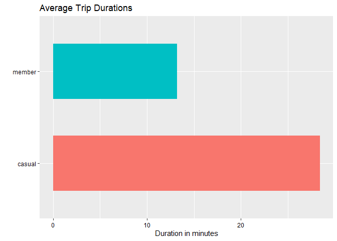
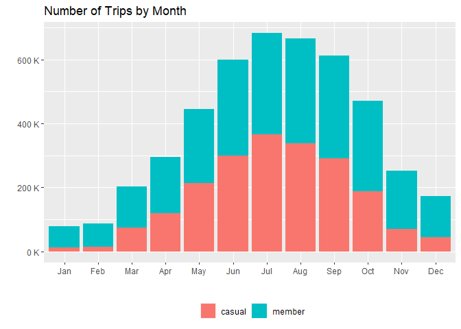
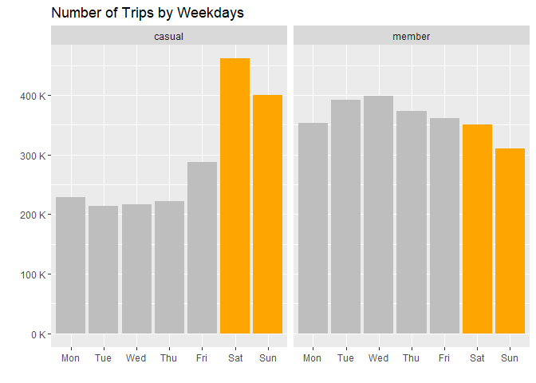
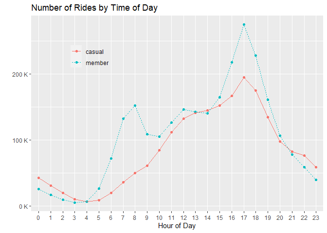
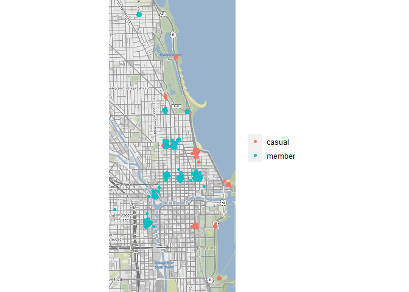
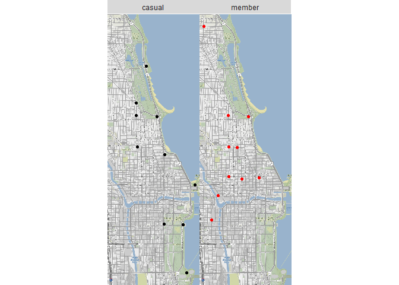
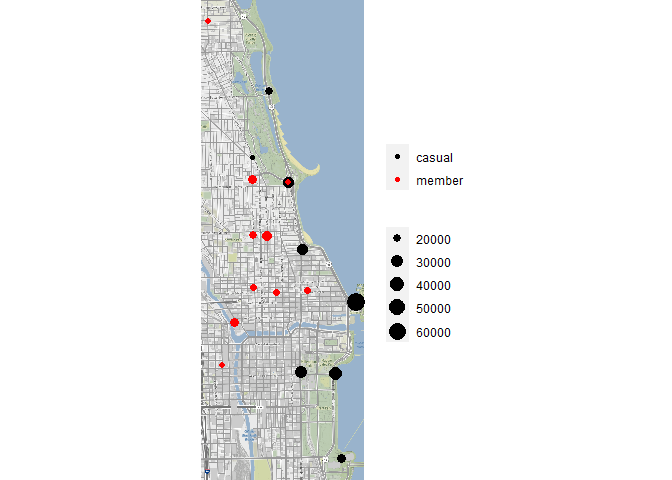

Google Data Analytics Certificate - Bike Share Case Study - Part 2
================
K.Wan
2022/4/4

This is Part 2 of my capstone challenge for [Google Data Analytics
Certificate](https://coursera.org/share/9818f287924f4512ec3145d8afb6b99b),
including two phases – **Analyse** and **Share**. [Part
1](https://github.com/keyiwan/Google-capstone/blob/main/bike-sharing01.md)
is completed with preparing and cleaning data. The second part will
start with a new file of processed data.

As usual, loading packages of use is the first step.

``` r
# install.packages("tidyverse")
# install.packages("lubridate")
# install.packages("scales")

library(tidyverse) # data import and tidy
library(lubridate) # functions set for date, time
library(ggplot2) # helps visualise data
library(scales) # functions: percent(); label_number()
```

------------------------------------------------------------------------

## Analyse

``` r
# import csv of cleaned data
dt_all02 <- read_csv("cleaned_data.csv")
```

Here comes the first question: How many observations fall under each
user type?

``` r
(dt_all_freq <- dt_all02 %>% 
  count(member_casual))
```

    ## # A tibble: 2 x 2
    ##   member_casual       n
    ##   <chr>           <int>
    ## 1 casual        2031039
    ## 2 member        2538407

As shown above, more than 507,368 rides were conducted by members than
casual riders in the whole time period.

Following is a descriptive analysis on **ride duration**, answering
questions such as:

> Is there a difference on total/average duration of trips between two
> groups of riders?  
> How is that difference varied on more aggregated levels like
> daily/monthly?

### Trip duration in total

A statistic summary of ride duration, measured in minutes spent on each
trip.

``` r
 dt_all02 %>%  
   group_by(member_casual) %>%  
   summarise(n = n(), 
             total = sum(ride_length_m),  
             mean = mean(ride_length_m), 
             median = median(ride_length_m),  
             max = max(ride_length_m),  
             min = min(ride_length_m)) %>% 
  ungroup() %>% 
  rename(type = member_casual) %>% 
# width=Inf to print all columns with 2 rows
# or use options(tibble.width=Inf)  
  print(n = 2, width = Inf) 
```

    ## # A tibble: 2 x 7
    ##   type         n     total  mean median   max   min
    ##   <chr>    <int>     <dbl> <dbl>  <dbl> <dbl> <dbl>
    ## 1 casual 2031039 57695524.  28.4  16.8  1439.     1
    ## 2 member 2538407 33592312.  13.2   9.75 1427.     1

Overall, more rides were taken by members while casual riders enjoyed
longer trips, contributing nearly double the accumulated trip duration
of members’ during the same time period.

The average duration of each ride by casual riders is around 28.4
minutes, two times more of the 13.2 minutes for annual members.

### Ride duration by month

``` r
# group summary on month
 dt_all02 %>%  
  group_by(member_casual, start_Month) %>% 
  summarise(sum = sum(ride_length_m), 
            mean = mean(ride_length_m)) %>%
  ungroup() %>% 
  arrange(member_casual, desc(sum)) %>% 
  rename(type = member_casual) %>% 
  head(12) 
```

    ## # A tibble: 12 x 4
    ##    type   start_Month       sum  mean
    ##    <chr>  <chr>           <dbl> <dbl>
    ##  1 casual Jul         10502955.  28.8
    ##  2 casual Jun          9341985.  31.1
    ##  3 casual Aug          9246271.  27.4
    ##  4 casual Sep          7668660.  26.4
    ##  5 casual May          7173380.  33.5
    ##  6 casual Oct          4600798.  24.6
    ##  7 casual Apr          3860655.  32.4
    ##  8 casual Mar          2433254.  32.5
    ##  9 casual Nov          1410656.  20.4
    ## 10 casual Dec           906566.  20.3
    ## 11 casual Feb           322847.  21.6
    ## 12 casual Jan           227496.  18.3

It seems that casual riders spent much more time on cycling for July,
June and August in total than other time of a year.

### Which weekday induced most traffic?

See the number of trips and average ride duration on each day of a week
for all users.

``` r
 dt_all02 %>%  
   mutate(start_wday = factor(start_wday, 
                              levels = c("Mon","Tue","Wed","Thu","Fri","Sat","Sun"))) %>%
   group_by(start_wday) %>%  
   summarise(n = n(),  
             sum = sum(ride_length_m),  
             mean = mean(ride_length_m)) %>% 
  ungroup()
```

    ## # A tibble: 7 x 4
    ##   start_wday      n       sum  mean
    ##   <fct>       <int>     <dbl> <dbl>
    ## 1 Mon        582014 11138952.  19.1
    ## 2 Tue        605821 10420861.  17.2
    ## 3 Wed        614700 10286544.  16.7
    ## 4 Thu        594966 10018268.  16.8
    ## 5 Fri        648908 12232708.  18.9
    ## 6 Sat        812241 19363918.  23.8
    ## 7 Sun        710796 17826587.  25.1

Compare ridership, average trip duration by weekday for members vs
casual riders.

    ## # A tibble: 14 x 5
    ##    type   weekday      n       sum  mean
    ##    <chr>  <fct>    <int>     <dbl> <dbl>
    ##  1 casual Mon     229094  6631544.  28.9
    ##  2 casual Tue     213847  5556801.  26.0
    ##  3 casual Wed     216633  5317038.  24.5
    ##  4 casual Thu     222197  5395626.  24.3
    ##  5 casual Fri     287122  7568258.  26.4
    ##  6 casual Sat     461605 14143649.  30.6
    ##  7 casual Sun     400541 13082608.  32.7
    ##  8 member Mon     352920  4507408.  12.8
    ##  9 member Tue     391974  4864059.  12.4
    ## 10 member Wed     398067  4969505.  12.5
    ## 11 member Thu     372769  4622642.  12.4
    ## 12 member Fri     361786  4664450.  12.9
    ## 13 member Sat     350636  5220269.  14.9
    ## 14 member Sun     310255  4743979.  15.3

Regardless of the user type, weekends undoubtedly enjoyed peak usage,
which can be helpful in terms of choosing optimal marketing times.

### Top 10 busiest stations

To better advertise memberships of Divvy, hence attracting more casual
riders to subscribe, stations mostly visited by casual users may be a
great option as locations for the upcoming campaign.

``` r
# station ids of 10 largest numbers of rides by casual riders
dt_all02 %>%  
   filter(member_casual == "casual") %>%  
   group_by(start_station_id) %>%  
   summarise(n = n()) %>% 
   ungroup() %>% 
   arrange(desc(n)) %>%  
   select(start_station_id, n) %>%  
   head(10) 
```

    ## # A tibble: 10 x 2
    ##    start_station_id     n
    ##    <chr>            <int>
    ##  1 13022            63837
    ##  2 13300            34325
    ##  3 13008            31788
    ##  4 13042            28327
    ##  5 LF-005           28322
    ##  6 15544            22353
    ##  7 TA1308000001     20329
    ##  8 TA1308000050     18741
    ##  9 13179            16093
    ## 10 KA1504000135     15708

Is there any difference on station preferences between casual riders and
annual members? Below is list of stations ranked by members usage.

    ## # A tibble: 10 x 2
    ##    start_station_id     n
    ##    <chr>            <int>
    ##  1 TA1307000039     23636
    ##  2 KA1503000043     23310
    ##  3 TA1308000050     22768
    ##  4 KA1504000135     20123
    ##  5 13045            18247
    ##  6 13016            18065
    ##  7 TA1306000012     18018
    ##  8 LF-005           17425
    ##  9 13137            16842
    ## 10 TA1305000032     16680

As shown above, there is an undeniably distinct difference on stations
choices made by members and casual riders.

Even though I think sticking to station id is easier, but for map viz,
names of locations are better for presentation. Since I will focus on
mainly the top 10 stations mostly visited by casual riders for past 12
months, only two ids in the top 10 list that also appears in the
duplicated list before: `13300` and `LF-005`. So I will fix the names of
stations belonging to those two ids.

It turns out, recently [Chicago’s iconic Lake Shore Drive has been
renamed in honor of Jean Baptiste Point
DuSable](https://blockclubchicago.org/2021/10/21/lake-shore-drive-signs-now-have-its-new-name-dusable-lake-shore-drive-honoring-citys-black-founder/),
so the `Lake Shore Dr` in the data set has been renamed
`DuSable Lake Shore Dr` shown in more recent records. And luckily, both
cases of duplicates are due to the same reason. Then I will just update
the station names accordingly.

``` r
# return station ids with multiple names
dt_all02 %>% 
  count(start_station_id, start_station_name) %>% 
  filter(start_station_id %in% c("13300", "LF-005"))
```

    ## # A tibble: 4 x 3
    ##   start_station_id start_station_name                     n
    ##   <chr>            <chr>                              <int>
    ## 1 13300            DuSable Lake Shore Dr & Monroe St  20582
    ## 2 13300            Lake Shore Dr & Monroe St          23634
    ## 3 LF-005           DuSable Lake Shore Dr & North Blvd 23433
    ## 4 LF-005           Lake Shore Dr & North Blvd         22314

``` r
# update unmatched names to latest versions
dt_all02 <- dt_all02 %>% 
  mutate(start_station_name = case_when(
    start_station_id == "13300" ~ "DuSable Lake Shore Dr & Monroe St",
    start_station_id == "LF-005" ~ "DuSable Lake Shore Dr & North Blvd",
    TRUE ~ start_station_name
  )) # case_when for multiple conditions with TRUE for rest cases
```

Then, an updated list of station names as follows:

    ## # A tibble: 10 x 3
    ##    id           name                                   n
    ##    <chr>        <chr>                              <int>
    ##  1 13022        Streeter Dr & Grand Ave            63837
    ##  2 13300        DuSable Lake Shore Dr & Monroe St  34325
    ##  3 13008        Millennium Park                    31788
    ##  4 13042        Michigan Ave & Oak St              28327
    ##  5 LF-005       DuSable Lake Shore Dr & North Blvd 28322
    ##  6 15544        Shedd Aquarium                     22353
    ##  7 TA1308000001 Theater on the Lake                20329
    ##  8 TA1308000050 Wells St & Concord Ln              18741
    ##  9 13179        Clark St & Lincoln Ave             16093
    ## 10 KA1504000135 Wells St & Elm St                  15708

### Station trips distribution

I’m also interested in a data frame with each row representing a unique
station id, columns including number of rides by members, by casual
riders, and their individual proportions in the total number of rides at
each station.

``` r
# return summarised data by groups
(prop_dt <- dt_all02 %>% 
  group_by(start_station_id, member_casual) %>% 
  summarise(n = n()) %>% 
  ungroup()) 
```

    ## # A tibble: 1,632 x 3
    ##    start_station_id member_casual     n
    ##    <chr>            <chr>         <int>
    ##  1 13001            casual        13488
    ##  2 13001            member        10852
    ##  3 13006            casual         3212
    ##  4 13006            member         6692
    ##  5 13008            casual        31788
    ##  6 13008            member         8263
    ##  7 13011            casual         5204
    ##  8 13011            member        11765
    ##  9 13016            casual        10233
    ## 10 13016            member        18065
    ## # ... with 1,622 more rows

This tibble having multiple values stacked in a small number of columns
needs the function `pivot_wider` to make it wider.

``` r
prop_dt %>% 
  pivot_wider(names_from = member_casual, values_from = n) %>% 
  mutate(total = casual + member, casual_freq = casual/total, member_freq = member/total) %>% 
  arrange(desc(casual))
```

    ## # A tibble: 835 x 6
    ##    start_station_id casual member total casual_freq member_freq
    ##    <chr>             <int>  <int> <int>       <dbl>       <dbl>
    ##  1 13022             63837  15559 79396       0.804       0.196
    ##  2 13300             34325   9891 44216       0.776       0.224
    ##  3 13008             31788   8263 40051       0.794       0.206
    ##  4 13042             28327  13905 42232       0.671       0.329
    ##  5 LF-005            28322  17425 45747       0.619       0.381
    ##  6 15544             22353   4747 27100       0.825       0.175
    ##  7 TA1308000001      20329  14941 35270       0.576       0.424
    ##  8 TA1308000050      18741  22768 41509       0.451       0.549
    ##  9 13179             16093  15496 31589       0.509       0.491
    ## 10 KA1504000135      15708  20123 35831       0.438       0.562
    ## # ... with 825 more rows

The list of stations boasting largest proportions of visits by casual
riders is virtually the same as the aforementioned list of popular
stations.

------------------------------------------------------------------------

## Share

It is time to visualise these findings to vividly demonstrate
differences on riding patterns between different rider types.

### Members ride more often than non-members

Below is a pie chart, displaying how the total number of rides is
distributed between members and casual riders.

``` r
dt_all02 %>% 
  group_by(member_casual) %>% 
  count() %>% 
  ungroup() %>% 
  mutate(perc = n/sum(n)) %>% 
  mutate(labels = paste0(scales::percent(perc), "\n", member_casual)) %>% # labels combining percent & text
  ggplot(aes(x = "", y = perc, fill = member_casual))+
  geom_col()+
  geom_text(aes(label = labels), position = position_stack(vjust = 0.5)) +
  labs(title = "Trips by Rider Type")+
  coord_polar("y") +
  theme_void() +
  theme(legend.position = "none")
```

<!-- -->

### Casual riders enjoy longer trips than members

``` r
# summary tibble
dt_length_all <- dt_all02 %>%  
   group_by(member_casual) %>%  
   summarise(number_of_rides = n(), 
             total = sum(ride_length_m),  
             mean = mean(ride_length_m), 
             median = median(ride_length_m),  
             max = max(ride_length_m),  
             min = min(ride_length_m)) %>% 
   ungroup() %>% 
   rename(type = member_casual)
print(dt_length_all, n = 2, width = Inf)
```

    ## # A tibble: 2 x 7
    ##   type   number_of_rides     total  mean median   max   min
    ##   <chr>            <int>     <dbl> <dbl>  <dbl> <dbl> <dbl>
    ## 1 casual         2031039 57695524.  28.4  16.8  1439.     1
    ## 2 member         2538407 33592312.  13.2   9.75 1427.     1

``` r
# plot horizontal bar chart
ggplot(dt_length_all, aes(x = type, 
                          y = mean, 
                          fill = type)) +
  geom_bar(stat = "identity", width = 0.6) +
  xlab("") + ylab("Duration in minutes") +
  coord_flip() +
  theme(legend.position = "none",
        axis.text.x = element_text(colour = "black"),
        axis.text.y = element_text(colour = "black")) +
  ggtitle("Average Trip Durations") 
```

<!-- -->

On average, casual riders spent 15.2 more minutes on a trip than
members. Comparing total duration of the past 12 months, members
accounted for merely 37 per cent.

### Visits peak in July

``` r
# plot a stacked bar chart for trips
dt_all02 %>% 
  mutate(start_Month = factor(start_Month, 
                              levels = c("Jan", "Feb", "Mar", "Apr", "May", "Jun", 
                                         "Jul", "Aug", "Sep", "Oct", "Nov", "Dec"))) %>% 
  # factor() for specifying the order
  group_by(member_casual, start_Month) %>% 
  summarise(number_of_rides = n(), 
            total_length = sum(ride_length_m), 
            mean_length = mean(ride_length_m)) %>% 
  ungroup() %>% 
 
  ggplot(aes(x = start_Month, 
             y = number_of_rides, 
             fill = member_casual)) + 
  scale_y_continuous(labels = label_number(suffix = " K", 
                                           scale = 1e-3)) +
  # label_number(): scale y-axis label to thousands (K)
  # for Millions (M), suffix="M", scale = 1e-6
  geom_col(position = position_stack(reverse = TRUE)) + 
  # position_stack(...) for reversing order of stacked groups
  ggtitle("Number of Trips by Month") +
  xlab("") + ylab("") +
  theme(legend.position = "bottom",
        legend.title = element_blank()) # remove legend title
```

<!-- -->

The bar plot shows that Q3 (July, August, September) experienced the
most rides in total and the number of trips peaked in July. Weather
could be a factor in driving up the use of sharing bikes as people enjoy
the outdoor activities more often on sunny days. On the other hand, the
winter season meets the smallest number of rides.

### Weekenders VS Daily Users

There is an apparent difference on the weekdays preferences between the
two groups.

Unlike an obvious increase on the number of rides by casual riders on
the weekends in comparison to the rest of a week, members use sharing
bikes almost daily and even least often on Saturdays and Sundays.

The distinction could be due to different functional focuses. It is
likely that most members use bikes as a transport for commuting to work
while non-members tend to cycle for leisure or exercise purposes on the
weekends.

<!-- -->

### What time do trips start?

``` r
# line graph for changes across timeline
dt_all02 %>% 
  mutate(hour_start = factor(hour(started_at))) %>% 
  group_by(member_casual, hour_start) %>% 
  summarise(n = n()) %>% 
  ungroup() %>% 
  ggplot(aes(x = hour_start, y = n, group = member_casual)) +
  geom_point(aes(color = member_casual))+
  geom_line(aes(linetype = member_casual,
                color = member_casual)) +
  ylab("Trips") + xlab("Hour of Day") +
  scale_y_continuous(labels = label_number(suffix = " K", scale = 1e-3))  + 
  ggtitle("Number of Rides by Time of Day") +
  theme(legend.position=c(0.2,0.8), 
        legend.title = element_blank(),
        legend.background = 
          element_rect(fill = "transparent", 
                       colour = "transparent"))+
  ylab("") 
```

<!-- -->

From the line graph above, rush hours for members appear at 8am and 5pm
(usually times for starting and finishing work) while there is only one
peak point for casual riders at 5pm.

### Top 10 stations

In this section, popular stations (roughly defined by number of trips)
will be mapped out on a background map of Chicago sourced from
[Stamen](http://maps.stamen.com/#watercolor/12/37.7706/-122.3782).

``` r
# extract the list of top 10 station names visited by casual
casual_station_names <- dt_all02 %>% 
  filter(member_casual == "casual") %>% 
  group_by(start_station_name) %>% 
  summarise(n = n()) %>% 
  ungroup() %>% 
  arrange(desc(n)) %>% 
  select(start_station_name, n) %>% 
  head(10)

# extract the list of top 10 station names visited by members
member_station_names <- dt_all02 %>% 
  filter(member_casual == "member") %>% 
  group_by(start_station_name) %>% 
  summarise(n = n()) %>% 
  ungroup() %>% 
  arrange(desc(n)) %>% 
  select(start_station_name, n) %>% 
  head(10)

# return the subset of top 10 casual stations
subset_casual <- dt_all02 %>% 
  filter(member_casual == "casual") %>% 
  filter(start_station_name %in% casual_station_names$start_station_name) %>% 
  select(member_casual, start_station_name, start_lng, start_lat, start_station_id) 

subset_member <- dt_all02 %>% 
  filter(member_casual == "member") %>% 
  filter(start_station_name %in% member_station_names$start_station_name) %>% 
  select(member_casual, start_station_name, start_lng, start_lat, start_station_id) 

map_data01 <- bind_rows(subset_casual, subset_member)
# map_data01 contains the whole set of varied lon and lat points for each hot station
```

Package `ggmap` is employed with function `qmplot()` automatically
setting backdrop for geographic data.

Citation for `ggmap`:  
D. Kahle and H. Wickham. ggmap: Spatial Visualization with ggplot2. The
R Journal, 5(1), 144-161. URL
<http://journal.r-project.org/archive/2013-1/kahle-wickham.pdf>

``` r
# install.packages("ggmap")
library(ggmap) # for mapping viz

qmplot(start_lng, start_lat, 
       data = map_data01, 
       maptype = "toner-background",
       color = member_casual, 
       legend = "right") +
  theme(legend.title = element_blank())
```

<!-- -->

Casual riders visited stations nearer to the seashore while members’
trips started more from inland stations that are situated more closely
to each other.

Alternatively every station can be plotted with one data point such as
the mean or median of group data. I prefer median since it is a more
robust metric, less impacted by outliers.

``` r
# use median to identify the location of each station

sum_station_casual <- dt_all02 %>% 
  group_by(start_station_name) %>% 
  mutate(lon_start = median(start_lng), 
         lat_start=median(start_lat)) %>% 
  ungroup() %>% 
  filter(member_casual == "casual") %>% 
  group_by(start_station_name) %>% 
  summarise(n = n(), 
            lon = mean(lon_start), 
            lat = mean(lat_start)) %>% 
  arrange(desc(n)) %>% 
  select(start_station_name, n, lon, lat) %>% 
  head(10) %>% 
  mutate(rider_type = "casual")

sum_station_member <- dt_all02 %>% 
  group_by(start_station_name) %>% 
  mutate(lon_start = median(start_lng), 
         lat_start=median(start_lat)) %>% 
  ungroup() %>% 
  filter(member_casual == "member") %>% 
  group_by(start_station_name) %>% 
  summarise(n = n(), 
            lon = mean(lon_start), 
            lat = mean(lat_start)) %>% 
  arrange(desc(n)) %>% 
  select(start_station_name, n, lon, lat) %>% 
  head(10) %>% 
  mutate(rider_type = "member")

sum_station <- bind_rows(sum_station_casual, sum_station_member)
```

``` r
# display station locations of two groups side by side

qmplot(lon, lat, data = sum_station, 
       maptype = "toner-background",
       color = rider_type, legend = "bottom") +
  scale_color_manual(values = c("black", "red")) +
   facet_wrap(~rider_type) + 
  theme(legend.position="none") 
```

<!-- -->

    ## # A tibble: 10 x 5
    ##    Top_stations_casual          trips_casual Top_stations_me~ trips_member  rank
    ##    <chr>                               <int> <chr>                   <int> <int>
    ##  1 Streeter Dr & Grand Ave             63837 Clark St & Elm ~        23636     1
    ##  2 DuSable Lake Shore Dr & Mon~        34325 Kingsbury St & ~        23310     2
    ##  3 Millennium Park                     31788 Wells St & Conc~        22768     3
    ##  4 Michigan Ave & Oak St               28327 Wells St & Elm ~        20123     4
    ##  5 DuSable Lake Shore Dr & Nor~        28322 Dearborn St & E~        18247     5
    ##  6 Shedd Aquarium                      22353 St. Clair St & ~        18065     6
    ##  7 Theater on the Lake                 20329 Wells St & Huro~        18018     7
    ##  8 Wells St & Concord Ln               18741 DuSable Lake Sh~        17425     8
    ##  9 Clark St & Lincoln Ave              16093 Broadway & Barr~        16842     9
    ## 10 Wells St & Elm St                   15708 Clinton St & Ma~        16680    10

Apart from maps and table, the size of points can also be scaled to
compare numbers of trips started from each station.

``` r
# showing number of trips by size of points

qmplot(lon, lat, data = sum_station, 
       maptype = "toner-background",
       color = rider_type, legend = "bottom", size = n) +
  scale_color_manual(values = c("black", "red")) +
  theme(legend.position = "right",
        legend.title = element_blank())
```

<!-- -->

In alignment with findings in Analysis stage, casual riders ride more
often than members with most popular stations attracting possibly more
tourists.

For instance, the Streeter Dr & Grand Ave is situated nearby to a very
popular pier in Chicago, and close to Jane Addams Memorial Park.

------------------------------------------------------------------------

## Summary

As the business task is to identify the difference between casual riders
and annual members and to give some insights into how to attract more
casual riders into memberships based the result of data analysis,
following are some recommendations I’d like to give:

-   The fact that casual riders spend more time on each ride than
    members indicates a big chance of varied subscription plans tailored
    for casual riders relishing long trips.

-   To better target casual riders, July is the most popular season
    welcoming most usages by both groups. More broadly, summer season is
    preferable to winter.

-   Marketing campaign can be set on weekends as casual riders use
    sharing bikes less often in other weekdays.

-   Afternoon or evening can be a fit time for advertising. More
    specifically, usage peak can be expected at around 5pm.

-   The list of stations mostly visited by casual riders can be a
    reasonable choice for campaign locations.
